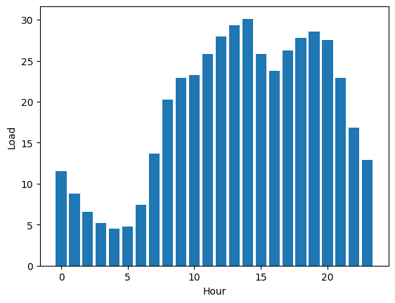

# The Project <a class="anchor" id="t1"></a>

One year ago, our team embarked on an exciting project at Mad Flow, aligning with the company's vision to enhance the quality of life in Madrid. The primary objective was to develop a real-time traffic forecasting system and present it through an intuitive interface, empowering citizens to plan their routes more efficiently. Traffic analysis has emerged as a critical aspect of smart cities, facilitating better road management and governance through improved traffic insights.

During the project, we also explored the possibility of incorporating additional data like precipitation and temperature to enhance the accuracy of our predictions. However, we encountered challenges in integrating the heterogeneous data provided by sensors in smart cities, particularly in Madrid, where climatic and traffic data covered the entire city center but required a complex infrastructure.

Throughout our testing phase, we encountered a significant performance limitation in the existing infrastructure, hindering our ability to swiftly incorporate new traffic datasets or generate new insights—critical components for the success of our project. It was evident that a change in implementation was necessary to overcome these hurdles and push the project forward.

Fortunately, we found a viable solution to our problem: Kdb+/q by KX. This platform proved to be exceptionally fast and flexible, enabling real-time data processing. Additionally, KX provided PyKX, an open-source library designed to be user-friendly for Python programmers—crucial for seamless integration with our existing Mad Flow infrastructure.

In this technical report, we will outline the process of migrating our code to the KX platform. Before delving into the implementation details, we will first present the use case and the current status of our project. By sharing our experiences with Kdb+/q and PyKX, we hope to shed light on the positive impact these tools have had on our endeavor at Mad Flow.

<div class="alert alert-block alert-info">
    <b> 🔍 You can find <a href="https://github.com/hablapps/AllRoadsLeadToPyKX/blob/Python-Version-Pre/AllRoadsLeadToPyKX.md">Original Python Project</a> in Github. 
</div>

**Index**

[**The project**](#t1)   
  [**The Use Case**](#t11)   
  [**The Data**](#t12)   
  [**The Cleaning**](#t13)   
  [**The Final Table**](#t14)   
  [**The Interpretation**](#t15)   
[**PyKX migration**](#t2)   
  [**PyKX saving the day!**](#t21)   
  [**Datasets**](#t23)   
  [**Model**](#t24)   
[**Qholic**](#t3)

## Use Case <a class="anchor" id="t11"></a>

The objective of the project is to prepare and join the traffic and weather data to be ingested by an LSTM model.

Although this project is novel in the city of Madrid, there are many articles that support it. For example, [F. Malik et al.](https://www.mdpi.com/1424-8220/20/13/3749) forecasted traffic in Madrid based on air pollution through a model based on LSTM.

There are many studies regarding the dependence of the weather on traffic, especially focused on rainfall. None of the studies are carried out in Madrid, but rather in several large cities such as Manchester ([A. Essien et al.](https://pure.manchester.ac.uk/ws/portalfiles/portal/72721911/DEXA_Camera_8_pages.pdf)), Shenzhen ([Y. Yao et al.](https://ieeexplore.ieee.org/document/8964560)) or Belgrade ([M. Vidas et al.](https://www.safetylit.org/citations/index.php?fuseaction=citations.viewdetails&citationIds[]=citjournalarticle_716898_14)). The results of these studies predict a 5-15% increase in traffic volume on weekdays during peak hours.

Regarding the use of PyKX on Pandas we can find several blogs in [KX developer] (https://kx.com/resources/developer-blog/) such as [A. Morrison](https://kx.com/blog/accelerating-python-workflows-using-pykx/) where he uses PyKX in the field of financial services. This article shows a big speed advantage of PyKX over Pandas.

## Input Data <a class="anchor" id="t12"></a>

Madrid weather and traffic data are offered by the [Madrid City Council](https://datos.madrid.es/portal/site/egob). These datasets include live and historical records. For model ingestion we only need the historical data, which is provided in CSV format. It's divided into months from the year 2018 to the present.

### Weather

[Weather data](https://datos.madrid.es/portal/site/egob/menuitem.3efdb29b813ad8241e830cc2a8a409a0/?vgnextoid=4950cc720ba29610VgnVCM2000001f4a900aRCRD&vgnextchannel=102612b9ace9f310VgnVCM100000171f5a0aRCRD&vgnextfmt=default) is captured by stations located throughout the city of Madrid. It has the following format:

|    |   weather_station |   magnitud |   year |   month |   day |    H01 | V01   | ...|
|---:|------------------:|-----------:|-------:|--------:|------:|-------:|------:|:------|
|  0 |               108 |         81 |   2022 |      12 |    22 |  270   | N     | ...|
|  1 |               108 |         82 |   2022 |      12 |    22 |    9   | N     |...|
|  2 |               108 |         83 |   2022 |      12 |    22 |   94.7 | N     |...|
|  3 |               108 |         86 |   2022 |      12 |    22 | 1031   | N     |...|
|  4 |               108 |         87 |   2022 |      12 |    22 |    2   | N     |...|


In the documentation we are told that the magnitude column indicates which meteorological measure unit has been taken in the row:

    · 80: ultraviolet
    · 81: wind
    · 82: direction
    · 83: temperature
    · 86: humidity
    · 87: pressure
    · 88: solar
    · 89: rainfall
    
Then we have two columns for each hour. The first tells us the value for the data type specified by the magnitude column and the other one if the result is valid or not. We also have columns related to the time in which the measurement was taken. Finally, there is the identifier of the meteorological station which we can connect with its coordinates using this other [table](https://datos.madrid.es/portal/site/egob/menuitem.c05c1f754a33a9fbe4b2e4b284f1a5a0/?vgnextoid=2ac5be53b4d2b610VgnVCM2000001f4a900aRCRD&vgnextchannel=374512b9ace9f310VgnVCM100000171f5a0aRCRD&vgnextfmt=default) provided by the Madrid city council:

|    |   weather_station |   Longitude |   Latitude |
|---:|------------------:|------------:|-----------:|
|  0 |                 4 |    -3.71226 |    40.4239 |
|  1 |                 8 |    -3.68232 |    40.4216 |
|  2 |                16 |    -3.63924 |    40.44   |
|  3 |                18 |    -3.73184 |    40.3948 |
|  4 |                24 |    -3.74734 |    40.4194 |

### Traffic

Traffic sensors can be found at traffic lights in the city of Madrid. The data obtained is made up of several measurements of the road situation such as speed or traffic volume. All of these metrics are coded into the "load" metric (a percentage that measures congestion). The [traffic table](https://datos.madrid.es/portal/site/egob/menuitem.c05c1f754a33a9fbe4b2e4b284f1a5a0/?vgnextoid=02f2c23866b93410VgnVCM1000000b205a0aRCRD&vgnextchannel=374512b9ace9f310VgnVCM100000171f5a0aRCRD) head is:

|    |   traffic_station | tipo_elem   |   intensidad |   ocupacion |   load |   vmed | error   |   periodo_integracion | date                |
|---:|------------------:|:------------|-------------:|------------:|-------:|-------:|:--------|----------------------:|:--------------------|
|  0 |              1001 | M30         |         3240 |           9 |      0 |     59 | N       |                     5 | 2022-12-01 00:00:00 |
|  1 |              1001 | M30         |         3240 |           9 |      0 |     59 | N       |                     5 | 2022-12-01 00:15:00 |
|  2 |              1001 | M30         |          300 |           1 |      0 |     66 | N       |                     5 | 2022-12-01 00:30:00 |


The table also contains a column for the date and another one that identifies the sensor that was used to take the measurement. We can use this latter one to link it with its coordinates using the following [table](https://datos.madrid.es/portal/site/egob/menuitem.c05c1f754a33a9fbe4b2e4b284f1a5a0/?vgnextoid=ee941ce6ba6d3410VgnVCM1000000b205a0aRCRD&vgnextchannel=374512b9ace9f310VgnVCM100000171f5a0aRCRD):

|    | "tipo_elem"   |   "distrito" |   "id" | "cod_cent"   | "nombre"                                                          |   "utm_x" |     "utm_y" |   Longitude |   Latitude |
|---:|:--------------|-------------:|-------:|:-------------|:------------------------------------------------------------------|----------:|------------:|------------:|-----------:|
|  0 | "URB"         |            4 |   3840 | "01001"      | "Jose Ortega y Gasset E-O - Pº Castellana-Serrano"                |    441615 | 4.47577e+06 |    -3.68832 |    40.4305 |
|  1 | "URB"         |            4 |   3841 | "01002"      | "Jose Ortega y Gasset O-E - Serrano-Pº Castellana"                |    441706 | 4.47577e+06 |    -3.68726 |    40.4305 |
|  2 | "URB"         |            1 |   3842 | "01003"      | "Pº Recoletos N-S - Almirante-Prim"                               |    441319 | 4.47484e+06 |    -3.69173 |    40.4221 |

## Data Cleaning  <a class="anchor" id="t13"></a>

Once the data has been loaded, we needed to prepare the data to be used in the analysis and the model. As we are dealing with heterogeneous datasets, the cleaning of the data will be done independently and the data will be assembled a single table later on.

### Weather

1. In the weather dataset we first have the date separated into day, month and year, but in traffic all these data are together. This is why the columns have been grouped into a date column of shape: ```day-month-year```. 

2. We also transform each hour value measurement and its validity into independent rows and take the opportunity to remove invalid measurements:

|       | hour            |   value |
|------:|:----------------|--------:|
|     0 | 0 days 00:00:00 |    7.1  |
|     1 | 0 days 00:00:00 |    6.8  |
|     2 | 0 days 00:00:00 |    2.8  |
|     3 | 0 days 00:00:00 |    5.6  |

3. To homogenize the time measure with the traffic table we join the date with the time. The new date shape is ```date-month-year hour:minute:second```

4. Finally, we convert the different types of measurement into columns so that it looks more organized:

|      | date                |   weather_station |   direction |   humidity |   pressure |   rainfall |   solar |   temperature |   wind |
|-----:|:--------------------|------------------:|------------:|-----------:|-----------:|-----------:|--------:|--------------:|-------:|
|    0 | 2022-12-01 00:00:00 |                 4 |           0 |          0 |          0 |        0   |       0 |           7.1 |   0    |
|    1 | 2022-12-01 00:00:00 |                 8 |           0 |         67 |          0 |        0   |       0 |           9.4 |   0    |
|    2 | 2022-12-01 00:00:00 |                16 |           0 |         73 |          0 |        0   |       0 |           8.9 |   0    |

### Traffic

1. First we filter out the values with measurement errors. In the documentation it is said that these values are represented with an "N". 

2. We only keep the load measurement, which is what we are interested in for the analysis.

3. We group the values for each date and station and calculate the average.

The average time for loading and processing a month of traffic information is **43.9 s**. The team is concerned about the slowness and the possible effect it will have on real-time data processing.

### Location

To join the two previous tables we need to know which traffic sensors correspond to the weather stations. To do this we decided to use a distance matrix and find the closest pairs between them. You could measure this distance directly using the coordinates, but to make the distances more understandable we used the Haversine distance, which calculates the distance in meters between a pair of coordinates. It can be seen in the next heatmap that these distances are between 0 and 20 km:
<table>
    <tr>
        <td style='text-align:center'>
            <figure>
                
                <figcaption style = "text-align: center"> <b>Figure 1:</b> Heatmap of distances in km between weather and traffic stations </figcaption>
            </figure>
        </td>
    </tr>
</table>

## The Final Table <a class="anchor" id="t14"></a>

Once we have prepared the 3 tables -weather, traffic and distance- we need to join them together somehow. Since the weather table has time intervals of 1 hour while the traffic ones have 15 minutes, we will join both tables with an asof join. And, finally, we can add the information of the time and the day of the week to study its dependence on the traffic load.

|    | date                |   traffic_station |   load |   Distance |   Closest |   weather_station |   direction |   humidity |   pressure |   rainfall |   solar |   temperature |   wind |   weekday |   hour |
|---:|:--------------------|------------------:|-------:|-----------:|----------:|------------------:|------------:|-----------:|-----------:|-----------:|--------:|--------------:|-------:|----------:|-------:|
|  0 | 2022-12-01 00:00:00 |              1001 |      0 |         15 |         1 |                 8 |           0 |         67 |          0 |          0 |       0 |           9.4 |      0 |         3 |      0 |
|  1 | 2022-12-01 00:00:00 |              1002 |      0 |         15 |         1 |                 8 |           0 |         67 |          0 |          0 |       0 |           9.4 |      0 |         3 |      0 |
|  2 | 2022-12-01 00:00:00 |              1003 |      0 |         14 |         1 |                 8 |           0 |         67 |          0 |          0 |       0 |           9.4 |      0 |         3 |      0 |
|  3 | 2022-12-01 00:00:00 |              1006 |      0 |         15 |         1 |                 8 |           0 |         67 |          0 |          0 |       0 |           9.4 |      0 |         3 |      0 |
|  4 | 2022-12-01 00:00:00 |              1009 |      0 |         14 |         0 |                 4 |           0 |          0 |          0 |          0 |       0 |           7.1 |      0 |         3 |      0 |

## Data interpretation <a class="anchor" id="t15"></a>

Several studies were carried out to find out which time variables could be interesting to add to the model. First off, since traffic is so dependent on time, the measurements will be filtered to obtain the days of the week and the hours where there is usually more traffic. This will make it easier for the test model to learn. School days tend to have more traffic than holidays. Just as there is usually more traffic during the day than at night. In the following figures we can verify that the data have a strong seasonality:

<table>
    <tr>
        <td style='text-align:center;'>
            <figure>
                
                <figcaption style = "text-align: center">   <b>Figure 2:</b> Load per Hour </figcaption>
            </figure>
        </td>
        <td>
            <figure>
                
                <figcaption style = "text-align: center">   <b>Figure 3:</b> Load per Weekday </figcaption>
            </figure>
        </td>
    </tr>
</table>

As such, we will filter our data so that we only use information between 10 a.m. and 8 p.m. and from Monday to Friday for the rest of the project.

Regarding the Rainfall-Load dependency we started seeing that rainy days are very few on our dataset:

|       |       rainfall |
|:------|---------------:|
| count | 841068         |
| mean  |      0.0130932 |
| std   |      0.194232  |
| min   |      0         |
| 50%   |      0         |
| 90%   |      0         |
| 99.9% |      2.9       |
| max   |     10.9       |

We can see in the percentiles of the precipitation column that there are very few recordings with rain. This is why the measurements were divided into different classes depending on the level of rain and we did a separate analysis for the data with heavy rain, moderate to moderate and no rain. The analysis was done hourly to avoid the temporal dependence of the load. We can verify this in the following table, where the average increase in hours of traffic congestion with rain can go from 5% to 14%, which agrees with the studies presented in [the Use Case](#t12).
<table>
    <tr>
        <td style='text-align:center'>
            <figure>
                
                <figcaption style = "text-align: center"> <b>Figure 4:</b> The average traffic load per hour for the measurements with heavy rain (blue), moderate rain (brown) and no rain (green).</figcaption>
            </figure>
        </td>
    </tr>
</table>

To verify that these differences between groups are significant, we can perform an anova test. And we see that for all hours there is great evidence that the load is affected by the different levels of rain. For example, for hour 12:

|             |          sum_sq |    df |        F |       PR(>F) |
|:------------|----------------:|------:|---------:|-------------:|
| C(rainfall) | 37650.7         |     6 |  20.1144 |   1.3346e-23 |
| Residual    |     8.01363e+06 | 25687 | nan      | nan          |

We decided to incorporate precipitation into the model. The rest of the meteorological conditions did not give such a clear result, so they were left out.

## Month 6:  The Model <a class="anchor" id="t16"></a>

To check the performance we created a toy model using a simple LSTM with 5 steps back to forecast the load at a single station.

The input includes only the 5 steps prior to the prediction of the load, it also includes the rainfall measure, the hour and day of the week columns. The results for a single station seem quite positive as can be seen in [Graph 6](#Image61). But the temporary cost for a single station and a single month is unaffordable for the project budget. Also, the pre-processing takes too long for the final application in real time.

<table><a class="anchor" id="Image61"></a>
    <tr>
        <td style='text-align:center;'>
            <figure>
                
                <figcaption style = "text-align: center">   <b>Figure 5:</b> Train vs Test loss plot  </figcaption>
            </figure>
        </td>
        <td>
            <figure>
                
                <figcaption style = "text-align: center">   <b>Figure 6:</b> Traffic Forecasting for a traffic station </figcaption>
            </figure>
        </td>
    </tr>
</table>


# PyKX migration <a class="anchor" id="t2"></a>

Now that we have cleared out the project's goal, we will explain the steps that have been taken for the code migration, which include a training stage in q and PyKX for our team, the datasets loading and cleaning and the model ingestion. But first of all we need to install and import PyKx:


```python
!pip install pykx
```

```python
import pykx as kx
```

<div class="alert alert-block alert-info">
<b> 🔍 A license is required to use some of the following features. You can find more information in <a href="https://code.kx.com/pykx/1.6/getting-started/installing.html">
            PyKX installation documentation</a>. 
</div>

## Learning PyKX <a class="anchor" id="t21"></a>

Before starting the project, the Mad Flow team received training from [Habla Computing](https://hablapps.com/) on q and PyKX. After this introduction to the KX platform, some of the developers fell in love with q, while others felt more comfortable in the Python ecosystem. PyKX is designed so that these two profiles are able to coexist in the same development environment. The team has compiled perspectives on programming with PyKX along with various techniques they discovered during training:

* **[Useful Read/Write Functions](https://code.kx.com/pykx/1.6/api/read.html)**

>*"PyKX offers several functions that help loading and writing data that are very versatile. Also, the parameters are very intuitive."* - Félix Functor 


```python
traffic_station = kx.q.read.csv('../pmed_ubicacion_12-2022.csv', types = "SII**FFFF", delimiter = ";", as_table=True)
traffic_station[:3].pd()
```

<div>
<table border="1" class="dataframe">
  <thead>
    <tr style="text-align: right;">
      <th></th>
      <th>tipo_elem</th>
      <th>distrito</th>
      <th>id</th>
      <th>cod_cent</th>
      <th>nombre</th>
      <th>utm_x</th>
      <th>utm_y</th>
      <th>longitud</th>
      <th>latitud</th>
    </tr>
  </thead>
  <tbody>
    <tr>
      <th>0</th>
      <td>URB</td>
      <td>4</td>
      <td>3840</td>
      <td>b'01001'</td>
      <td>b'Jose Ortega y Gasset E-O - P\xc2\xba Castell...</td>
      <td>441615.343347</td>
      <td>4.475768e+06</td>
      <td>-3.688323</td>
      <td>40.430502</td>
    </tr>
    <tr>
      <th>1</th>
      <td>URB</td>
      <td>4</td>
      <td>3841</td>
      <td>b'01002'</td>
      <td>b'Jose Ortega y Gasset O-E - Serrano-P\xc2\xba...</td>
      <td>441705.882340</td>
      <td>4.475770e+06</td>
      <td>-3.687256</td>
      <td>40.430524</td>
    </tr>
    <tr>
      <th>2</th>
      <td>URB</td>
      <td>1</td>
      <td>3842</td>
      <td>b'01003'</td>
      <td>b'P\xc2\xba Recoletos N-S - Almirante-Prim'</td>
      <td>441319.371258</td>
      <td>4.474841e+06</td>
      <td>-3.691727</td>
      <td>40.422132</td>
    </tr>
  </tbody>
</table>
</div>


* **[Use pythonic indexing](https://code.kx.com/pykx/1.6/user-guide/fundamentals/indexing.html)**

> *"Accessing data from q objects such as lists or tables from Python can be done with indexing similar to what you can use in numpy or pandas. This has made my job much easier."* - Jesús Lambda 


```python
elem = traffic_station["tipo_elem"]
lat = traffic_station["latitud"]
print(lat[:5])
```

    40.4305 40.43052 40.42213 40.42143 40.43378


* **[Use q functions]()**

> *"For those like me who want to delve into the q language and gain experience, you can use language functions, ...* 


```python
distinct = kx.q("distinct", elem) # unique values in the list
print(distinct) 
```

    `URB`other`M30


> *... iterate over them ...*


```python
print(kx.q("lower").each(distinct)) # lower case unique values of the list
```

    `urb`other`m30


>*... or even create and use them with PyKX objects."* - Eloy Projection


```python
print(kx.q("{u !(sum x=) each u:distinct x}", elem)) # Count the occurrences of distinct values
```

    URB  | 4266
    other| 128
    M30  | 296


* **Use [Numpy](https://code.kx.com/pykx/1.6/user-guide/advanced/numpy.html) and  [Pandas](https://code.kx.com/pykx/1.6/user-guide/advanced/Pandas_API.html)**

> *"Those of us who are not yet so familiar with the ecosystem that we can continue using part of the functionality of Numpy (universal functions)...*


```python
import numpy as np

def numpy_mean(arr):
    return np.add.reduce(arr) / len(lat)

print(numpy_mean(lat))
```

    40.42871


>*... and from Pandas via the Pandas API."* - Pepe Doric


```python
import os
os.environ['PYKX_ENABLE_PANDAS_API'] = 'true'
import pykx as kx
import numpy as np
import pandas as pd

traffic_station[traffic_station["tipo_elem"]=="other"][:5].pd() # filter rows where the values of a column meet a condition
```


<div>
<table border="1" class="dataframe">
  <thead>
    <tr style="text-align: right;">
      <th></th>
      <th>tipo_elem</th>
      <th>distrito</th>
      <th>id</th>
      <th>cod_cent</th>
      <th>nombre</th>
      <th>utm_x</th>
      <th>utm_y</th>
      <th>longitud</th>
      <th>latitud</th>
    </tr>
  </thead>
  <tbody>
    <tr>
      <th>0</th>
      <td>URB</td>
      <td>4</td>
      <td>3840</td>
      <td>b'01001'</td>
      <td>b'Jose Ortega y Gasset E-O - P\xc2\xba Castell...</td>
      <td>441615.343347</td>
      <td>4.475768e+06</td>
      <td>-3.688323</td>
      <td>40.430502</td>
    </tr>
    <tr>
      <th>1</th>
      <td>URB</td>
      <td>4</td>
      <td>3840</td>
      <td>b'01001'</td>
      <td>b'Jose Ortega y Gasset E-O - P\xc2\xba Castell...</td>
      <td>441615.343347</td>
      <td>4.475768e+06</td>
      <td>-3.688323</td>
      <td>40.430502</td>
    </tr>
    <tr>
      <th>2</th>
      <td>URB</td>
      <td>4</td>
      <td>3840</td>
      <td>b'01001'</td>
      <td>b'Jose Ortega y Gasset E-O - P\xc2\xba Castell...</td>
      <td>441615.343347</td>
      <td>4.475768e+06</td>
      <td>-3.688323</td>
      <td>40.430502</td>
    </tr>
    <tr>
      <th>3</th>
      <td>URB</td>
      <td>4</td>
      <td>3840</td>
      <td>b'01001'</td>
      <td>b'Jose Ortega y Gasset E-O - P\xc2\xba Castell...</td>
      <td>441615.343347</td>
      <td>4.475768e+06</td>
      <td>-3.688323</td>
      <td>40.430502</td>
    </tr>
    <tr>
      <th>4</th>
      <td>URB</td>
      <td>4</td>
      <td>3840</td>
      <td>b'01001'</td>
      <td>b'Jose Ortega y Gasset E-O - P\xc2\xba Castell...</td>
      <td>441615.343347</td>
      <td>4.475768e+06</td>
      <td>-3.688323</td>
      <td>40.430502</td>
    </tr>
  </tbody>
</table>
</div>


<div class="alert alert-block alert-info">
<b>To use it we only have to import Numpy and Pandas and activate a flag. The Pandas API is still in the development phase, so it does not have all the functions of Pandas implemented yet. More information in <a href="https://code.kx.com/pykx/1.6/user-guide/advanced/Pandas_API.html"> Pandas API </a> . 
</div>

* **Use [qSQL querys](https://code.kx.com/pykx/1.6/api/query.html)**

> *"qSQL queries are very powerful and concise at the same time. PyKX allows you to query PyKX objects as well as API functions...* 


```python
print(kx.q.qsql.select(traffic_station, {"name":"5 # nombre"}, where="tipo_elem = `other")) # filter rows where the values of a column meet a condition
```

    name        
    ------------
    "03FL08PM01"
    "03FL08PM02"
    "03FL20PM01"
    "03FL56PM01"
    "03FT08PM01"


> *...or using our own functions q."*  - ....


```python
print(kx.q("{select name:5#nombre from x where tipo_elem = `other}", traffic_station)) # filter rows where the values of a column meet a condition
```

    name        
    ------------
    "03FL08PM01"
    "03FL08PM02"
    "03FL20PM01"
    "03FL56PM01"
    "03FT08PM01"


* **Use [SQL querys](https://code.kx.com/pykx/1.6/api/query.html)**

>*"Whoa! PyKX lets you use SQL queries too!"*- ....


```python
kx.q.sql("select nombre as name from $1 where tipo_elem='other' limit 5", traffic_station)
```


    pykx.Table(pykx.q('
    name        
    ------------
    "03FL08PM01"
    "03FL08PM02"
    "03FL20PM01"
    "03FL56PM01"
    "03FT08PM01"
    '))


* **Q Context**

> *"I'm more comfortable programming in q, so I work in the q context. PyKX objects can be passed into the q context and work with them as if you were in a q ecosystem."* - ....


```python
kx.q["traffic_station"] = traffic_station # Move Pykx Object to Q Context

print(kx.q("select name:5#nombre from traffic_station where tipo_elem = `other")) # Working with the table inside q
```

    name        
    ------------
    "03FL08PM01"
    "03FL08PM02"
    "03FL20PM01"
    "03FL56PM01"
    "03FT08PM01"


* **Python/Q Transform**

> *"I'm new to the project and still have to catch up with q. In the meantime I can pass the objects from q to pandas...*


```python
traffic_station.pd().head()
```


<div>
<table border="1" class="dataframe">
  <thead>
    <tr style="text-align: right;">
      <th></th>
      <th>tipo_elem</th>
      <th>distrito</th>
      <th>id</th>
      <th>cod_cent</th>
      <th>nombre</th>
      <th>utm_x</th>
      <th>utm_y</th>
      <th>longitud</th>
      <th>latitud</th>
    </tr>
  </thead>
  <tbody>
    <tr>
      <th>0</th>
      <td>URB</td>
      <td>4</td>
      <td>3840</td>
      <td>b'01001'</td>
      <td>b'Jose Ortega y Gasset E-O - P\xc2\xba Castell...</td>
      <td>441615.343347</td>
      <td>4.475768e+06</td>
      <td>-3.688323</td>
      <td>40.430502</td>
    </tr>
    <tr>
      <th>1</th>
      <td>URB</td>
      <td>4</td>
      <td>3841</td>
      <td>b'01002'</td>
      <td>b'Jose Ortega y Gasset O-E - Serrano-P\xc2\xba...</td>
      <td>441705.882340</td>
      <td>4.475770e+06</td>
      <td>-3.687256</td>
      <td>40.430524</td>
    </tr>
    <tr>
      <th>2</th>
      <td>URB</td>
      <td>1</td>
      <td>3842</td>
      <td>b'01003'</td>
      <td>b'P\xc2\xba Recoletos N-S - Almirante-Prim'</td>
      <td>441319.371258</td>
      <td>4.474841e+06</td>
      <td>-3.691727</td>
      <td>40.422132</td>
    </tr>
    <tr>
      <th>3</th>
      <td>URB</td>
      <td>4</td>
      <td>3843</td>
      <td>b'01004'</td>
      <td>b'P\xc2\xba Recoletos S-N - Pl. Cibeles- Recol...</td>
      <td>441301.632986</td>
      <td>4.474764e+06</td>
      <td>-3.691929</td>
      <td>40.421433</td>
    </tr>
    <tr>
      <th>4</th>
      <td>URB</td>
      <td>4</td>
      <td>3844</td>
      <td>b'01005'</td>
      <td>b'(AFOROS) P\xc2\xba Castellana S-N  - Eduardo...</td>
      <td>441605.765072</td>
      <td>4.476132e+06</td>
      <td>-3.688470</td>
      <td>40.433782</td>
    </tr>
  </tbody>
</table>
</div>


>*... numpy, ...*


```python
lat.np()[:5]
```


    array([40.43050187, 40.43052394, 40.42213209, 40.42143334, 40.43378206])


> *... and Python to work on ...*


```python
lat.py()[:5]
```


    [40.4305018691825,
     40.4305239406404,
     40.4221320929972,
     40.4214333442836,
     40.4337820578943]


>*... and then back to q so that colleagues can continue the work."* - ....


```python
kx.toq(lat.py())
```

    pykx.FloatVector(pykx.q('40.4305 40.43052 40.42213 40.42143 40.43378 40.42351 40.42816 40.42879 40.426..'))


During the development of the project some of these methods will be described in depth. The best thing is that they are fully compatible with each other, so developers can choose the one that is most comfortable for them!

## Datasets <a class="anchor" id="t22"></a>

### Weather

The data loading will be done with the utilities provided by [PyKX](https://code.kx.com/pykx/1.4/api/read.html):


```python
weather = kx.q.read.csv('../dic_meteo22.csv', types='I'*4 + '*'*4 + 'FS'*24, delimiter=';')
```

The parameters of this function are quite standard. The path to the file and the delimiter are indicated. We highlight the *types* parameter that expects the q [types](https://code.kx.com/q/basics/datatypes/) of each column. Our table is now a PyKX object:


```python
type(weather)
```


    pykx.wrappers.Table


As we can see, it's not inside the q context. Let's see how to access these objects and how to use q features on them. Let's start with the simple *xcol* function, which allows us to rename columns:


```python
weather = kx.q.xcol({'ANO': 'year', 'MES': 'month', 'DIA': 'day', 'ESTACION':'weather_station', 'MAGNITUD':'magnitude'}, weather)
```

We see that this function is overloaded in PyKX. Many q functions are available through the `pykx.q` interface. The attributes are identical to those expected in the q function but with Python structures. These functions are compiled and perfectly explained in the [PyKX documentation](https://code.kx.com/pykx/1.6/api/q/q.html). 

Apart from this functions we have the `kx.q.qsql` interface, which allows us to query into tables. Specifically we used `select`, `update` and `delete`, which share some common characteristics, mainly with the arguments they receive.

Both `select` and `update` share roughly this function call structure:

`kx.q.sql.{function}({tab}, columns=..., where=..., by=...)`

The `columns` argument expects either a list of strings or a dictionary where the key is the column name and the value is the actual value you want in this column if let's say you want to apply a function to it. Let's look at this specific example:


```python
weather = kx.q.qsql.delete(weather, ['PUNTO_MUESTREO', 'PROVINCIA', 'MUNICIPIO'])
```

With the above code we have removed several columns that are not relevant to the analysis.

The next task we need to do is combine the year, month, and day into a single date column. To do this, we started by accessing these three columns. This can be done by indexing:


```python
print(weather["year", "month", "day"])
```

    "2022" "2022" "2022" "2022" "2022" "2022" "2022" "2022" "2022" "2022" "2022" ..
    "12"   "12"   "12"   "12"   "12"   "12"   "12"   "12"   "12"   "12"   "12"   ..
    "22"   "22"   "22"   "22"   "22"   "22"   "22"   "01"   "02"   "03"   "04"   ..


We can see that the result is three lists of the sample size. Our goal is a list of sample size with the three elements that make up the date joined together:


```python
print(kx.q.flip(weather["year", "month", "day"])[:3])
```

    "2022" "12" "22"
    "2022" "12" "22"
    "2022" "12" "22"


Looks like we're getting close now we have a sample size list with a list in each position containing 3 elements: the day, the month and the year. To join each set of the list into a single joined element, the *each* iterator will be used:


```python
print(kx.q.each(kx.q.raze, kx.q.flip(weather["year", "month", "day"]))[:3])
```

    "20221222"
    "20221222"
    "20221222"


All that remains is to convert the data type from string to date. Unfortunately, some functions (especially the overloaded glyphs) are not yet implemented. For example cast (`$`), take (`#`), concat (`,`)... So we are forced to abandon pythonic way of calling q functions and perform this casting writing kdb+/q code using the `pykx.q()` method:


```python
date = kx.q('"D"$',(kx.q.each(kx.q.raze, kx.q.flip(weather["year", "month", "day"]))))
print(date[:3])
```

    2022.12.22 2022.12.22 2022.12.22


Finally, we add this column to our table:


```python
weather_ = kx.q.qsql.update(weather, columns = {'date': date})
```

Some team members started using q code instead of PyKX functions in the pythonic way, as they found the code more elegant and concise. Once the team had a little more fluency, a function written entirely in q was proposed:


```python
weather = kx.q.qsql.update(weather, columns = {'date':'"D"$ raze each flip(year;month;day)'})
```

Again, both solutions are fully compatible, even combinable, it is up to the programmer to use one or the other methodology. 

The three columns that are already included in date can now be removed:


```python
weather = kx.q.qsql.delete(weather, ['year', 'month', 'day'])
```

The current state of the weather table is as follows:


```python
weather[:3].pd()
```


<div>
<table border="1" class="dataframe">
  <thead>
    <tr style="text-align: right;">
      <th></th>
      <th>weather_station</th>
      <th>magnitude</th>
      <th>H01</th>
      <th>V01</th>
      <th>H02</th>
      <th>V02</th>
      <th>H03</th>
      <th>V03</th>
      <th>H04</th>
      <th>V04</th>
      <th>...</th>
      <th>V20</th>
      <th>H21</th>
      <th>V21</th>
      <th>H22</th>
      <th>V22</th>
      <th>H23</th>
      <th>V23</th>
      <th>H24</th>
      <th>V24</th>
      <th>date</th>
    </tr>
  </thead>
  <tbody>
    <tr>
      <th>0</th>
      <td>108</td>
      <td>81</td>
      <td>270.0</td>
      <td>N</td>
      <td>252.0</td>
      <td>N</td>
      <td>216.0</td>
      <td>N</td>
      <td>242.0</td>
      <td>N</td>
      <td>...</td>
      <td>V</td>
      <td>228.0</td>
      <td>V</td>
      <td>227.83</td>
      <td>V</td>
      <td>213.67</td>
      <td>V</td>
      <td>233.83</td>
      <td>V</td>
      <td>2022-12-22</td>
    </tr>
    <tr>
      <th>1</th>
      <td>108</td>
      <td>82</td>
      <td>9.0</td>
      <td>N</td>
      <td>8.0</td>
      <td>N</td>
      <td>9.0</td>
      <td>N</td>
      <td>8.0</td>
      <td>N</td>
      <td>...</td>
      <td>V</td>
      <td>10.0</td>
      <td>V</td>
      <td>9.00</td>
      <td>V</td>
      <td>9.00</td>
      <td>V</td>
      <td>8.00</td>
      <td>V</td>
      <td>2022-12-22</td>
    </tr>
    <tr>
      <th>2</th>
      <td>108</td>
      <td>83</td>
      <td>94.7</td>
      <td>N</td>
      <td>97.6</td>
      <td>N</td>
      <td>96.6</td>
      <td>N</td>
      <td>97.5</td>
      <td>N</td>
      <td>...</td>
      <td>V</td>
      <td>91.4</td>
      <td>V</td>
      <td>93.80</td>
      <td>V</td>
      <td>96.30</td>
      <td>V</td>
      <td>98.70</td>
      <td>V</td>
      <td>2022-12-22</td>
    </tr>
  </tbody>
</table>
<p>3 rows × 51 columns</p>
</div>


Now it's time to turn our attention into breaking down the H* and V* queries into multiple rows, and supplying a time column to avoid missing information. The way to proceed in q would be to use functional qSQL to select the columns that follow the previous patterns, but we are going to take advantage of the fact that the q code in PyKX is introduced through strings to avoid it:


```python
def functionalSearch(cols, pattern, func):
  xcols = cols[kx.q.where(kx.q.like(cols, pattern))]
  xstring = func.format(kx.q.sv(b";", kx.q.string(xcols)).py().decode("utf-8"))
  return xcols, xstring
```

The above function receives a list of columns, a pattern to search for, and a q function in string format that passes as an argument the columns found following that pattern in qSQL format (where columns are accessed with their names and not with a symbol). Applying this to all columns starting with *"H"* returns these columns as a vector of symbols and a string of these columns in qSQL format:


```python
cols = kx.q.cols(weather)
found_columns, qsql_function = functionalSearch(cols, b'H*', "{}")

print("Columns found: ", found_columns)
print("qSQL function: ", qsql_function)
```

    Columns found:  `H01`H02`H03`H04`H05`H06`H07`H08`H09`H10`H11`H12`H13`H14`H15`H16`H17`H18`H19`..
    qSQL function:  H01;H02;H03;H04;H05;H06;H07;H08;H09;H10;H11;H12;H13;H14;H15;H16;H17;H18;H19;H20;H21;H22;H23;H24


This is very powerful, as it allows us to use qSQL with variables without having to use functional forms (usually complicated for first-time kdb+/q developers).


<div class="alert alert-block alert-info">
<b> Although for reasons of the post we try to stay as long as possible in PyKX, the use of Python entirely to form these queries in string format avoids encoding transformations.
</div>


Let's use the above function for the columns beginning **H**, which will give us the measurement value, and the columns that begin with **V**, which tell us if the measurement is valid. The function that we must use so that the measurements in column format become rows is *flip*:


```python
hcols, value = functionalSearch(cols, b'H*', "flip({})")
vcols, valid = functionalSearch(cols, b'V*', "flip({})")
```

Now we just have to pass our built-in functions in string format to the qSQL "update" function, together with the 24 hours repeated the initial number of rows:


```python
weather = kx.q.qsql.update(weather, columns = {'hour': 'count[i]#enlist 01:00*til 24', 'values': value, 'valid': valid})
```

Columns starting with **H** or **V** can be removed by using the trick again to prevent functional qSQL:


```python
weather = kx.q.qsql.delete(weather, columns = kx.q.raze(hcols,vcols).py())
```

Let's see the result:


```python
weather[:3].pd()
```


<div>
<table border="1" class="dataframe">
  <thead>
    <tr style="text-align: right;">
      <th></th>
      <th>weather_station</th>
      <th>magnitude</th>
      <th>date</th>
      <th>hour</th>
      <th>values</th>
      <th>valid</th>
    </tr>
  </thead>
  <tbody>
    <tr>
      <th>0</th>
      <td>108</td>
      <td>81</td>
      <td>2022-12-22</td>
      <td>[0 minutes, 60 minutes, 120 minutes, 180 minut...</td>
      <td>[270.0, 252.0, 216.0, 242.0, 239.0, 246.0, 233...</td>
      <td>[N, N, N, N, N, N, N, N, N, N, V, V, V, V, V, ...</td>
    </tr>
    <tr>
      <th>1</th>
      <td>108</td>
      <td>82</td>
      <td>2022-12-22</td>
      <td>[0 minutes, 60 minutes, 120 minutes, 180 minut...</td>
      <td>[9.0, 8.0, 9.0, 8.0, 8.0, 8.0, 8.0, 8.0, 8.0, ...</td>
      <td>[N, N, N, N, N, N, N, N, N, N, V, V, V, V, V, ...</td>
    </tr>
    <tr>
      <th>2</th>
      <td>108</td>
      <td>83</td>
      <td>2022-12-22</td>
      <td>[0 minutes, 60 minutes, 120 minutes, 180 minut...</td>
      <td>[94.7, 97.6, 96.6, 97.5, 97.5, 98.2, 98.8, 98....</td>
      <td>[N, N, N, N, N, N, N, N, N, N, V, V, V, V, V, ...</td>
    </tr>
  </tbody>
</table>
</div>


Now all we have to do is expand the table so that each element of the lists corresponds to a row:


```python
weather = kx.q.ungroup(weather)
```

We can shrink the table a bit more by removing the rows that are not valid and joining the date with the time:


```python
weather = kx.q.qsql.select(weather, where = 'valid=`V')
weather = kx.q.qsql.update(weather, columns = {'date': 'date+hour'})
weather = kx.q.qsql.delete(weather, columns = ["valid", "hour"])
weather[:3].pd()
```


<div>
<table border="1" class="dataframe">
  <thead>
    <tr style="text-align: right;">
      <th></th>
      <th>weather_station</th>
      <th>magnitude</th>
      <th>date</th>
      <th>values</th>
    </tr>
  </thead>
  <tbody>
    <tr>
      <th>0</th>
      <td>108</td>
      <td>81</td>
      <td>2022-12-22 10:00:00</td>
      <td>263.00</td>
    </tr>
    <tr>
      <th>1</th>
      <td>108</td>
      <td>81</td>
      <td>2022-12-22 11:00:00</td>
      <td>247.83</td>
    </tr>
    <tr>
      <th>2</th>
      <td>108</td>
      <td>81</td>
      <td>2022-12-22 12:00:00</td>
      <td>215.83</td>
    </tr>
  </tbody>
</table>
</div>


The **magnitude** column is required to give semantics to the **value**. As established by the dataset creators, the different magnitudes correspond to the items that we collect in the following dictionary:


```python
magnitude = {80:"ultraviolet", 
             81:"wind", 
             82:"direction", 
             83:"temperature", 
             86:"humidity", 
             87:"pressure", 
             88:"solar", 
             89:"rainfall"}
```

We just have to change the key by the value of the dictionary. Note that in the following functions an object from the Python world is being passed to a q function. If Python objects have a direct translation in q, such as dictionaries, they can be passed as attributes to PyKX functions. Underneath, PyKX takes care of transforming it to q.


```python
weather = kx.q('{update magnitude: x magnitude from y}', magnitude, weather)
```

Finally, all you have to do is separate the different weather conditions into different columns:


```python
weather = kx.q('{exec (value x)#magnitude!values by date,weather_station from y}',magnitude,weather)
```

The exec query allows us to convert a dictionary stored in a column into multiple columns with the key as the column name and the values as the data in that column. This is useful when we create a dictionary made up of the weather conditions of each row associated with their values. By applying it and grouping we have the weather conditions in different columns for each weather entry and weather station.

### Traffic

This second table will also be loaded into the Python environment:


```python
traffic = kx.q.read.csv('../12-2022.csv', types="IPSIIIISI", delimiter=';')
```

We are interested in knowing the average load by date and by season, removing measurement errors. The power of qSQL allows us to do this in a single query:


```python
traffic = kx.q.qsql.select(traffic,
                         columns = {'traffic_load': 'avg carga'},
                         by = {"date":'fecha', "traffic_station": 'id'}, 
                         where = "error=`N")
```

### Location

Both traffic and weather station tables will be loaded into the environment of q:


```python
kx.q["weather_station"] = kx.q.read.csv('../Estaciones_control_datos_meteorologicos.csv', types=" IFF", delimiter=";", as_table=True)
kx.q["traffic_station"] = kx.q.read.csv('../pmed_ubicacion_12-2022.csv', types = "SII**FFFF", delimiter = ";", as_table=True)
```

We can now access these objects inside the q context without needing to pass them as PyKX or Python objects. For example, let's rename the columns in both tables to standardize them:


```python
kx.q("weather_station:(`CODIGO_CORTO`LONGITUD`LATITUD!`weather_station`longitude`latitude)xcol weather_station")
_=kx.q("traffic_station:(`id`longitud`latitud!`traffic_station`longitude`latitude)xcol traffic_station")
```

To bring them to the Python environment, you just have to return them using q code:

```python
kx.q("table")
```

Our goal is to join these two tables. There seems to be no identifier that allows us to do a standard join. However, both the weather and traffic stations are located by coordinates. We can use the distance between the stations for measuring traffic and weather to join them. To calculate the distance between two coordinates, the Harvesine distance can be used as discussed earlier. This distance function is already developed in Python but it is not available on q.

One option would be to reimplement it in q, but this is not feasible in case we were dealing with more complex libraries. Although slower, there is the alternative of passing our q objects to Python and working with them. However, it is advisable to keep using q objects for as long as possible. These features we just explained for moving from Python objects to q and vice versa allow us, at least temporarily, to reuse Python code. It is also reasonable for the size of tables we are working with in this step. To introduce our q objects in this function, we can use some of the PyKX features to transform them into Python objects that we talked about in [Learning Pykx]().


```python
from haversine import haversine_vector, Unit
dist = kx.toq(
            haversine_vector(kx.q('`longitude`latitude # weather_station').pd(), 
                             kx.q('`longitude`latitude # traffic_station').pd(),
                             Unit.KILOMETERS, comb=True))
```

We now have a matrix that measures the distance in kilometers for each pair of traffic and weather stations. We can select the pairs of station identifiers whose minimum distance:


```python
ids = kx.q.each(kx.q('{first where x=min x}'), dist)
distance_table = kx.q('{traffic_station ^ weather_station[x]}' ,  ids)
distance_table = kx.q.qsql.delete(distance_table, columns = ['tipo_elem','distrito','cod_cent','nombre','utm_x','utm_y','longitude', 'latitude'])
```

### Final Table

The joining of the three tables is fairly straightforward. The one of distances can be joined with any of the two by means of a simple left join. The traffic and weather ones have to be joined with asof join as they have different time intervals. Finally, two columns are added to convey the seasonality of the data to the model: time and day of the week.


```python
complete = kx.q.lj(traffic, kx.q.xkey('traffic_station', distance_table))
complete = kx.q.aj(kx.toq(['weather_station', 'date']), complete, weather)
complete = kx.q.qsql.update(kx.q("0^",complete),  {"hour":"`hh$date", "weekday":'("d"$date)mod 7'})
```

Let's look at this last table:


```python
kx.q("5#",complete).pd()
```


<div>
<table border="1" class="dataframe">
  <thead>
    <tr style="text-align: right;">
      <th></th>
      <th></th>
      <th>traffic_load</th>
      <th>weather_station</th>
      <th>ultraviolet</th>
      <th>wind</th>
      <th>direction</th>
      <th>temperature</th>
      <th>humidity</th>
      <th>pressure</th>
      <th>solar</th>
      <th>rainfall</th>
      <th>hour</th>
      <th>weekday</th>
    </tr>
    <tr>
      <th>date</th>
      <th>traffic_station</th>
      <th></th>
      <th></th>
      <th></th>
      <th></th>
      <th></th>
      <th></th>
      <th></th>
      <th></th>
      <th></th>
      <th></th>
      <th></th>
      <th></th>
    </tr>
  </thead>
  <tbody>
    <tr>
      <th rowspan="5" valign="top">2022-12-01</th>
      <th>1001</th>
      <td>0.0</td>
      <td>24</td>
      <td>0.0</td>
      <td>0.54</td>
      <td>239.0</td>
      <td>6.0</td>
      <td>84.0</td>
      <td>946.0</td>
      <td>1.0</td>
      <td>0.0</td>
      <td>0</td>
      <td>5</td>
    </tr>
    <tr>
      <th>1002</th>
      <td>0.0</td>
      <td>24</td>
      <td>0.0</td>
      <td>0.54</td>
      <td>239.0</td>
      <td>6.0</td>
      <td>84.0</td>
      <td>946.0</td>
      <td>1.0</td>
      <td>0.0</td>
      <td>0</td>
      <td>5</td>
    </tr>
    <tr>
      <th>1003</th>
      <td>0.0</td>
      <td>24</td>
      <td>0.0</td>
      <td>0.54</td>
      <td>239.0</td>
      <td>6.0</td>
      <td>84.0</td>
      <td>946.0</td>
      <td>1.0</td>
      <td>0.0</td>
      <td>0</td>
      <td>5</td>
    </tr>
    <tr>
      <th>1006</th>
      <td>0.0</td>
      <td>24</td>
      <td>0.0</td>
      <td>0.54</td>
      <td>239.0</td>
      <td>6.0</td>
      <td>84.0</td>
      <td>946.0</td>
      <td>1.0</td>
      <td>0.0</td>
      <td>0</td>
      <td>5</td>
    </tr>
    <tr>
      <th>1009</th>
      <td>0.0</td>
      <td>110</td>
      <td>0.0</td>
      <td>0.00</td>
      <td>0.0</td>
      <td>0.0</td>
      <td>0.0</td>
      <td>0.0</td>
      <td>0.0</td>
      <td>0.0</td>
      <td>0</td>
      <td>5</td>
    </tr>
  </tbody>
</table>
</div>


## Model <a class="anchor" id="t23"></a>


```python
kx.q("minMaxScale:{[l] ({(x-y)%(z-y)}[;min l;max l]')l}")
                  
final = kx.q.qsql.select(complete, columns = {"date": "date",
                                              "traffic_station":"traffic_station",
                                              "hour":"hour", 
                                              "weekday": "weekday", 
                                              "traffic_load": "traffic_load%100", 
                                              "temperature":"minMaxScale temperature", 
                                              "rainfall":"minMaxScale rainfall"}
                                    )
```

During this migration from Pandas, the main hassle was to migrate the time_window function, as it relied on loops. The way we approached it was to first understand the input we had, the output we needed and then think of an idiomatic way to implement it using q instead of doing a 1:1 migration, which would have probably be more costly in terms of time. In this case, our input was a table and our output was a list of matrices for each station. We created several functions that helped us during the process:

* **sliding window**: given a matrix, x, divides it into chunks of length y:


```python
_=kx.q("""sw:{({y#z _x}[x;y;]')til count b:y _x}""")
```

* **get target**: For a given matrix, x, it takes the target located in the column z and the first lines are eliminated to match with the chunks length y:


```python
_=kx.q("""gt:{y _(flip x)[z]}""") # gets target (in position z)
```

* **to Matrix**: Transform the table x to a matrix:


```python
_=kx.q("""toMatrix:{({[t;i]value t[i]}[x;]')til count x:flip x}""") # / table to matrix
```

* **prepareData**: Create the train and test datasets. Select the model needed columns *columns* from the table grouped by traffic station. For each traffic station it lefts *ntest* rows for test. It divide the data with chunks of length *chunkLen*. Finally it create a list of dictionaries for training data and training target (the load column) and test data target.
    
    First off, regardless of whether we needed the train or test output, we needed to get either the last *ntest* records or up to the last *ntest* records. Since we needed to repeat this operation for the given columns, we decided that a functional statement would be the best fit.

    Once we shaped the data the way we needed, it was time to build the list of matrices. This needed to be done using a sliding window but, in order to return a list of matrices (not a list of tables), we used the **toMatrix** function to transform a table to a matrix and **sw** (sliding window) function to apply the sliding window based on a single huge matrix.

    As for the y data, we used the function **gt** (get target) that returned the target (traffic load) as a list with the first *chunkLen*+1 entries removed:


```python
_=kx.q("""
        prepareData:{[data; ntest; chunkLen; columns; locTarget]  
            train:(toMatrix')?[data;();`traffic_station;columns!({(y;(-;(count;x);z);x)}[;_;ntest]')columns]; 
            test:(toMatrix')?[data;();`traffic_station;columns!({(y;(-;(count;x);z);x)}[;#;ntest]')columns];                                                                               
            (((sw[;chunkLen]')test;(gt[;chunkLen;locTarget]')test);((sw[;chunkLen]')train;(gt[;chunkLen;locTarget]')train))   
        }
    """)
```

Lets test this function with only one station:


```python
station_id = 4010

station = kx.q.qsql.select(final, where=["traffic_station="+str(station_id)])

data = kx.q("prepareData", station, 500, 5, kx.SymbolVector(['rainfall', 'traffic_load', 'hour', 'weekday']), 1)

X_train, y_train = np.array(data[0][0][station_id].py()), np.array(data[0][1][station_id].py())
X_test, y_test =  np.array(data[1][0][station_id].py()), np.array(data[1][1][station_id].py())
```

And now we will try this datasets with a simple LSTM model:


```python
from keras.models import Sequential
from keras.layers import Dense, LSTM
import numpy as np
import matplotlib.pyplot as plt


model = Sequential()

model.add(LSTM(units = 50, return_sequences=False, input_shape=[None,4]))
model.add(Dense(units = 1))

model.compile(loss='mae', optimizer='adam')

history = model.fit(X_train, y_train, 
                    epochs=50, batch_size=8, 
                    validation_data=(X_test, y_test), 
                    verbose=0, shuffle=False)

plt.plot(history.history['loss'], label='train')
plt.plot(history.history['val_loss'], label='test')

plt.legend()
plt.show()
```


    

    


We can see the performance of the model in the following graph:


```python
plt.plot(y_test, label='test real')
plt.plot(range(400,495), model.predict(X_test[400:], verbose=0).flatten(), label='test predict')
plt.legend()
plt.show()
```


    

    


# Qholic <a class="anchor" id="t3"></a>

When the team got comfortable with q they started using it almost entirely through `kx.q`, as it was more concise. But the programming became somewhat tedious having to use strings. This is why it was decided to jump to a q environment. But as seen in the previous chapter, there was Python code that the team couldn't port to q. For this reason it was decided to stay in PyKX but this time inside the q environment.

The pykx.q library allows Python code execution on a q environment and, as a result, it opens up the door for new opportunities when dealing with existing codebases as it allows for importing and using Python libraries, both installed on the system and available as .py files.

In our case we use both of these options. We will focus only on the opportunities we found to use Python code with pykx.q and leave the link to the project's [q script]() for the interested reader.

First, we want to execute the `haversine_vector` function to measure the distance between coordinates. Since it's not available on q, we decided to use pykx.q to incorporate this library straight into our q code with these lines:

```q
.pykx.pyexec"from haversine import haversine_vector, Unit";
```

This function expects two Pandas DataFrames as input, so we need to change the default conversion type from "np" or Numpy to "pd" or Pandas:

```q
.pykx.setdefault"pd";
```

Having done this, we can "move" our input variables to the Python memory space using `.pykx.set`

```q
.pykx.set[`a;`longitude`latitude#a];
.pykx.set[`b;`longitude`latitude#b];
```

And finally execute our function

```q
(.pykx.eval"haversine_vector(a, b, Unit.KILOMETERS, comb=True)")`
```

Notice the backtick at the end, this is for converting back to a q type.


The other way we can run Python code is to load a .py (renamed to .p) file using `\l`. This could be done as follows:

```q
system"l kerasmodel.p";
```

Here we have defined two functions named `fit` and `predict`. We can load them and use them like this:

```q
modelfit:.pykx.get`fit;
modelfit[train[0][3403];train[1][3403];test[0][3403];test[1][3403]];
modelpredict:.pykx.get`predict;
res:modelpredict[train[0][3403]];
```

As for the rest of the code we explained throughout the PyKX migration part, it proved to be quite straightforward, especially when dealing with the code written using `pykx.q()` as strings.

# Final thoughts

In the end, the project was a success: it was possible to convert a code with a chaotic organization and performance problems, into a concise and understandable one accelerated thanks to Kdb+/q. PyKX has allowed a heterogeneous team in terms of Kdb+/q experience to work together on the project. This is thanks to the different levels of integration that PyKX has and their compatibility with each other. It has also introduced less experienced team members to Kdb+/q in a language friendly way. Even finally, the code was migrated again this time to pykx from the q side.

The pykx.q library allows, as we have discussed earlier, to use existing Python codebases. This feature is really useful, specially when dealing with code migrations from Python. In our experience, we found specially tough to match the Python input shape to the one converted from q. After converting to Python with `.pykx.set` we often had to mess around with this transformed objects inside the Python environment or change the default conversion type to match it with the expected input the Python function needed. Once that was dealt with, the experience using this library was really nice and technically impressive.

Since the data we needed to transfer back and forth between memory spaces was not that big (we were cautious this was the case) we didn't notice a performance loss at all. Instead, we achieved a significant improvement compared to Pandas.

Overall we would rate both PyKX libraries highly since it enables users to reuse existing code, reducing the time needed to perform a migration from and to these two languages.
